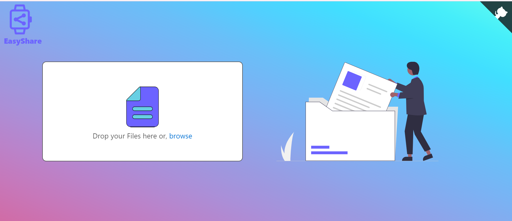
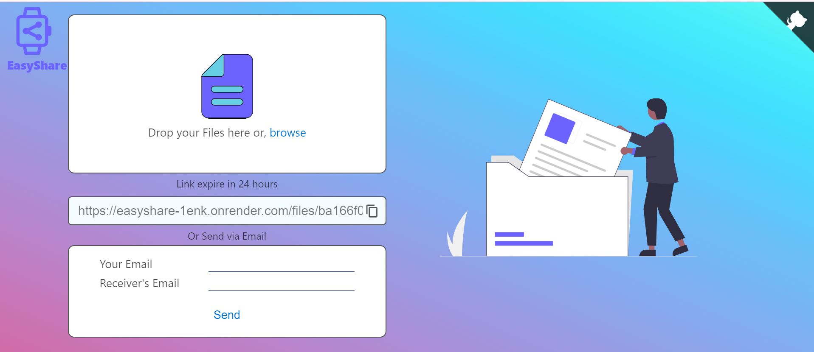
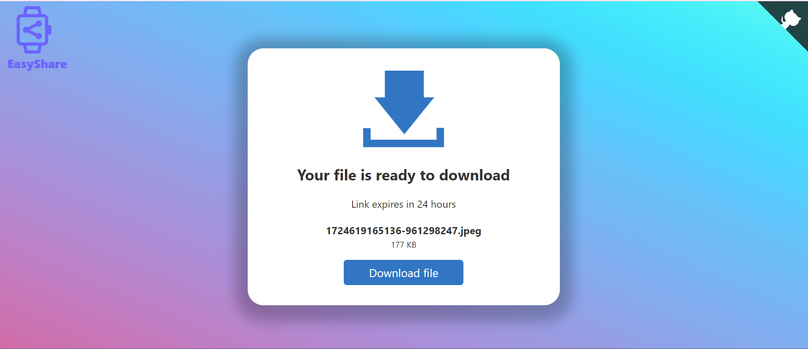

# EasyShare



EasyShare is a web application that allows users to easily upload and share files. The application supports drag-and-drop functionality for seamless file uploads and provides a unique link for each file that can be shared with others.

## [Deployed Link ](https://easy-share-ravi.netlify.app/)
   
## Features

- **Drag-and-Drop Upload:** Effortlessly upload files by dragging and dropping them into the upload area.
- **File Sharing:** Generate a unique link for each uploaded file, making it easy to share with others.
- **Responsive Design:** The interface is fully responsive, ensuring a smooth experience across all devices.
- **Secure File Storage:** Files are stored securely and are accessible only via the generated link.
- **Sharing vis Email:** The download link of the uploaded file can be shared via email easily.


## Technologies Used

- **Frontend:**
  - HTML, CSS, JavaScript
  - CSS Media Query To make it Responsive
  - XMLhttpRequest
  - Drag-and-Drop API

- **Backend:**
  - Node.js
  - Express.js
  - MongoDB (or another database if used)
  - multer
  - nodemailer
  - ejs

- **Deployment:**
  - Frontend - Netlify & Backend - Render

## Installation

1. Clone the repository:

    ```bash
    git clone https://github.com/ravikumar9519/EasyShare.git
    cd EasyShare
    ```

2. Install dependencies:

    ```bash
    npm install
    ```

3. Set up environment variables:

    Create a `.env` file in the root directory and add your environment variables:

    ```bash
    PORT=3000
    MONGO_URI=your_mongodb_connection_string
    ```

4. Run the application:

    ```bash
    npm start
    ```

5. Visit `http://localhost:3000` in your browser to see the application in action.

## License

This project is licensed under the MIT License. See the [LICENSE](LICENSE) file for details.

## Contact

If you have any questions or need further assistance, feel free to contact me at [ravikumarbharti959493@gmail.com](mailto:ravikumarbharti959493@gmail.com).
